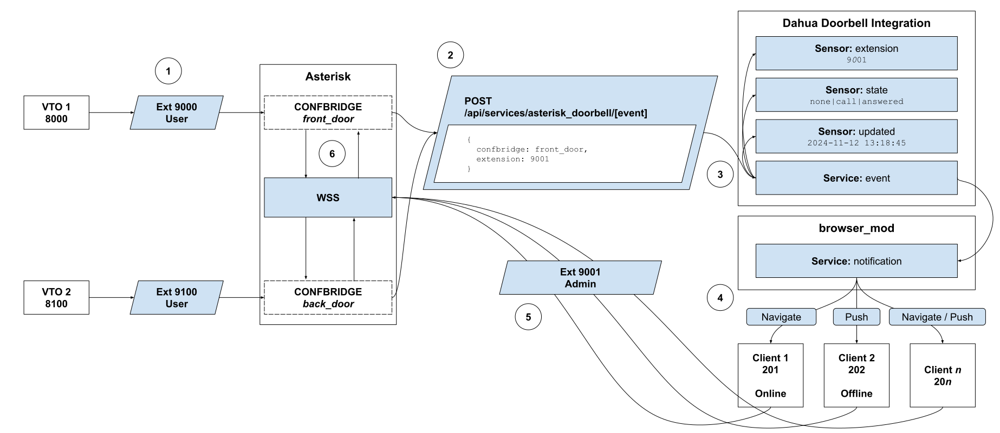

# Asterisk Doorbell Integration
### Developed for the VTO2202 Video Doorbells

This was inspired by TECH7Fox's excellent [Asterisk Integration](https://github.com/TECH7Fox/Asterisk-integration), but designed specifically to integrate Dahua VTO doorbells. Similar Asterisk-compatible doorbells should work, but are untested.

### How It's Different
* The Asterisk WebRTC connection remains open while HA is active, which allows you to answer incoming calls quicker
* Designed specifically for the flow of receiving a call, receiving a notification and then answering the call

Included in this integration is a Lovelace card to answer and hang up calls.

## Goals
The primary goal is to create a relatively simple way to replace a Asterisk VTH station and to receive doorbell calls directly in Home Assistant with minimal configuration.

## Roadmap
1. Tie PJSIP extensions to the browser_mod device IDs instead of creating unnecessary persons in HA.
1. Create a new SIP card designed specifically for video doorbells, specifically the Asterisk VTO2202.  It will be included in the integration instead of being a separate installation.
1. Better handling of the video call to device notification flow

## Requirements
* [HACS](https://www.hacs.xyz/docs/use/download/download/#to-download-hacs-ossupervised) - **(Required)** Necessary to install the following integrations
* [HA Asterisk Addon](https://github.com/TECH7Fox/asterisk-hass-addons) - **(Required)** Provides an Asterisk server as a Home Assistant add-on.
* [Browser Mod](https://github.com/thomasloven/hass-browser_mod) - **(Required)** Used to identify individual HA instances and send users directly to the correct dashboard to answer a call.
* [WebRTC Card](https://github.com/AlexxIT/WebRTC) - (Recommended) This card is used to display the video feed from the doorbell
* [go2rtc](https://github.com/AlexxIT/go2rtc) (Recommended) Improves video streaming

## Installation

### 1. Install HACS
1. Follow the instructions found [here](https://www.hacs.xyz/docs/use/download/download/#to-download-hacs)

### 2. Install the Asterisk Addon
1. Install the Addon
1. Complete the configuration.  We'll be updating the configuration manually later, so just get it running.
1. Start the Asterisk server

### 3. Install Browser Mod, if not already installed
1. Open HACS
1. Search for and install Browser Mod
1. On each device that runs Home Assistant, do the following:
   1. Click on Browser Mod in the left hand menu
   2. Give each device a unique browser ID.  i.e. beth_laptop
   3. Disable Auto-register as you should only register the browsers you want registered
   4. Repeat this procedure on every device that HA is installed on.

**Important**: Complete the above installation and configuration before moving forward.

### 4. Install this integration

Download using **HACS**
 1. Go to HACS
 2. Click on the 3 points in the upper right corner and click on `Custom repositories`
 3. Paste (https://github.com/itsbrianburton/asterisk-doorbell-integration/ into `Add custom repository URL` and by category choose Integration
 4. Click on add and check if the repository is there.
 5. You should now see Asterisk integration. Click `INSTALL`
 6. Restart Home Assistant.
 7. Go to integrations and find Asterisk.
 8. Fill in the fields and click add. If succesful, you should now see your PJSIP/SIP devices.
